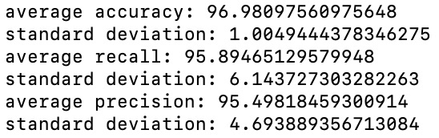

# ErrorAnalysis
## Intro to Computer Science - 360-420-DW - 03
## Arthur Ayestas Hilgert 1736055

## Distributions of Model Accuracy

The test set is shuffled before its generation.  Thus, it will return different test values every test run.  There are 444 benign data points and 237 malignant data points.  If we were to assume that a program randomly assigned its results.  Its accuracy would be 50%.  If a program would assume all values to be benign, it would have a 65.19% accuracy rate.  This is a sensible lower bound for accuracy rates of program predictions.

## Analysis of different error types

A false positive is a return value of positive (malignant), when the patient should actually be assigned a negative value (benign).  A false negative is a return value of negative (benign), when the patient should actually be assigned a positive value (malignant).  Accuracy is the quantity of total correct returns divided by quantity of total data points.  Recall is true positive returns divided by the value of total actual positive data points.  Precision is true positive returns divided by the total number of predicted positive values (predicted malignant).  A lower bound for recall rates is 0%.  In this situation, a program would predict false for all points.  A more sensible lower bound would be 50%, if all predicted returns were assigned a random value.  A sensible lower bound for a precision rate is about 34.8% for a randomly assigning predictor (this would be the total number of actual correct values divided by the number of all data points).  Alternatively, if all returns were set to positive recall would be at 100%.

## Results 

average accuracy: 96.98097560975648 
standard deviation: 1.0049444378346275 
average recall: 95.89465129579948 
standard deviation: 6.143727303282263 
average precision: 95.49818459300914 
standard deviation: 4.693889356713084 

These results are significantly above the baseline values.

### Changes in K Value

The previous results were conducted at a k value of 3.  As the k value increases recall is degraded, accuracy remains relatively constant, and precision increases marginally to an upper bound of 97%.

